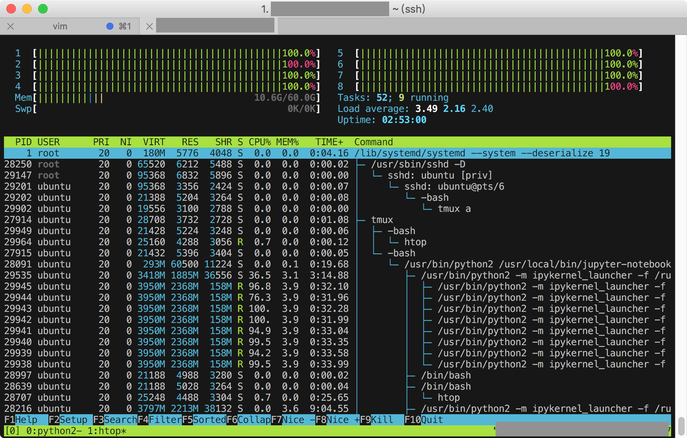
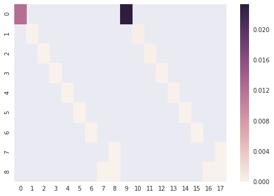
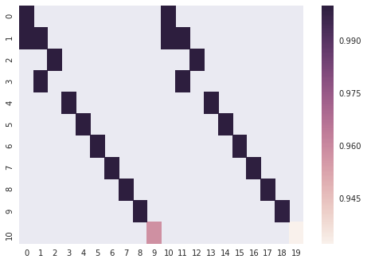
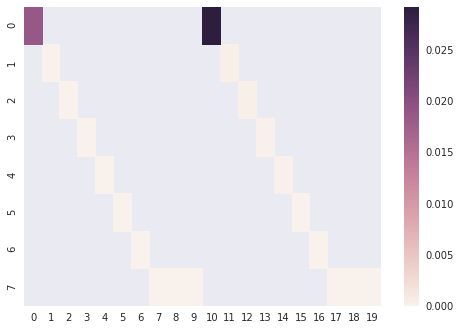
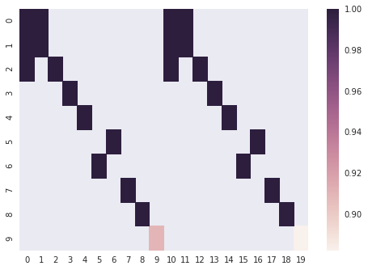
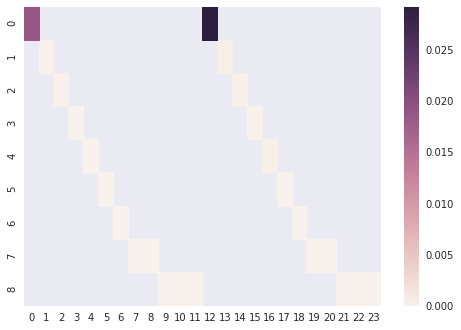
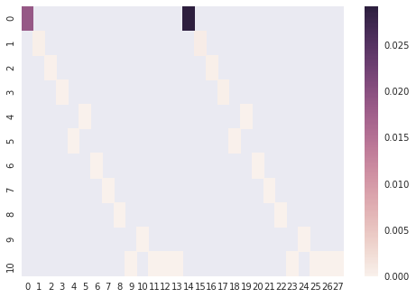
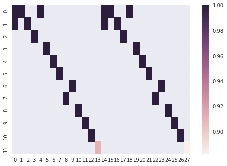

# HW2

這次作業先透過 numpy 把 CSV 資料讀取進來，再經由上次作業的結果表示出效果差的 label，做了標記處理，接下來就用 GridSearchCV 找出有用的 feature。

為了這次作業，手邊的運算資源不夠，所以租借了 AWS EC2 的雲端機器來加速運算。

使用期間，memory 沒有超過 10GB，但是 CPU core有全部吃滿。



## max_dpeth = 10




運算時間大約兩分半

（這裡還沒有做詳細的記錄，使用的參數跟下面的只有 max_dpeth 的差異）

## max_depth 10 -> 5




```
> after 2 min 5.17766594887 sec
-- xgboost_param --
{'reg_alpha': 0, 'colsample_bylevel': 1, 'scale_pos_weight': 1, 'learning_rate': 0.4, 'max_delta_step': 0, 'base_score': 0.6, 'colsample_bytree': 0.6, 'silent': 1, 'min_child_weight': 5, 'subsample': 0.9, 'reg_lambda': 1, 'random_state': 5, 'objective': 'binary:logistic', 'max_depth': 5, 'gamma': 0}
    test-auc-mean  test-auc-std  train-auc-mean  train-auc-std
0        0.909807  1.858604e-02        0.882118       0.029168
1        0.999949  3.000683e-05        0.999742       0.000168
2        0.999915  5.606668e-05        0.999722       0.000151
3        0.999879  6.734087e-05        0.999619       0.000239
4        0.999852  7.605838e-05        0.999537       0.000261
5        0.999994  4.773752e-06        0.999937       0.000056
6        1.000000  9.930137e-17        0.999990       0.000013
7        1.000000  4.890621e-07        0.999982       0.000020
8        1.000000  0.000000e+00        0.999999       0.000003
9        1.000000  4.965068e-17        0.999999       0.000003
10       1.000000  4.965068e-17        1.000000       0.000000
11       1.000000  4.965068e-17        1.000000       0.000000
12       1.000000  4.965068e-17        1.000000       0.000000
13       1.000000  4.965068e-17        1.000000       0.000000
14       1.000000  4.965068e-17        1.000000       0.000000
15       1.000000  4.965068e-17        1.000000       0.000000
16       1.000000  9.930137e-17        1.000000       0.000000
17       1.000000  0.000000e+00        1.000000       0.000000
18       1.000000  4.965068e-17        1.000000       0.000000
19       1.000000  0.000000e+00        1.000000       0.000000
```

可以看到 max_depth 對於時間的影響不是很大

## learning_reate 0.4 -> 0.25




```
> after 2 min 9.25574493408 sec
-- xgboost_param --
{'reg_alpha': 0, 'colsample_bylevel': 1, 'scale_pos_weight': 1, 'learning_rate': 0.25, 'max_delta_step': 0, 'base_score': 0.6, 'colsample_bytree': 0.6, 'silent': 1, 'min_child_weight': 5, 'subsample': 0.9, 'reg_lambda': 1, 'random_state': 5, 'objective': 'binary:logistic', 'max_depth': 5, 'gamma': 0}
    test-auc-mean  test-auc-std  train-auc-mean  train-auc-std
0        0.909807  1.858604e-02        0.882118       0.029168
1        0.999928  2.691474e-05        0.999705       0.000251
2        0.999854  8.958800e-05        0.999670       0.000208
3        0.999776  1.148329e-04        0.999441       0.000298
4        0.999687  1.608069e-04        0.999184       0.000413
5        0.999982  1.464467e-05        0.999871       0.000072
6        1.000000  3.260414e-07        0.999957       0.000027
7        0.999998  2.171911e-06        0.999944       0.000036
8        1.000000  4.965068e-17        0.999993       0.000013
9        1.000000  3.260414e-07        0.999979       0.000018
10       1.000000  7.021667e-17        1.000000       0.000000
11       1.000000  4.965068e-17        0.999996       0.000005
12       1.000000  4.965068e-17        1.000000       0.000000
13       1.000000  4.965068e-17        1.000000       0.000000
14       1.000000  4.965068e-17        1.000000       0.000000
15       1.000000  4.965068e-17        1.000000       0.000000
16       1.000000  4.965068e-17        1.000000       0.000000
17       1.000000  0.000000e+00        1.000000       0.000000
18       1.000000  0.000000e+00        1.000000       0.000000
19       1.000000  0.000000e+00        1.000000       0.000000
```

## learning_rate 0.25 -> 0.1





```
> after 2 min 7.13355588913 sec
-- xgboost_param --
{'reg_alpha': 0, 'colsample_bylevel': 1, 'scale_pos_weight': 1, 'learning_rate': 0.1, 'max_delta_step': 0, 'base_score': 0.6, 'colsample_bytree': 0.6, 'silent': 1, 'min_child_weight': 5, 'subsample': 0.9, 'reg_lambda': 1, 'random_state': 5, 'objective': 'binary:logistic', 'max_depth': 5, 'gamma': 0}
    test-auc-mean  test-auc-std  train-auc-mean  train-auc-std
0        0.909807  1.858604e-02        0.882118       0.029168
1        0.999988  1.775355e-05        0.999803       0.000138
2        0.999801  1.232176e-04        0.999594       0.000236
3        0.999686  1.659474e-04        0.999412       0.000334
4        0.999555  2.302457e-04        0.999105       0.000463
5        0.999946  3.170365e-05        0.999840       0.000081
6        0.999996  3.326981e-06        0.999954       0.000035
7        0.999993  6.903884e-06        0.999926       0.000044
8        1.000000  0.000000e+00        0.999971       0.000027
9        0.999999  1.421182e-06        0.999962       0.000029
10       1.000000  4.965068e-17        0.999988       0.000016
11       0.999999  1.304166e-06        0.999974       0.000023
12       1.000000  0.000000e+00        0.999991       0.000013
13       1.000000  0.000000e+00        1.000000       0.000000
14       1.000000  0.000000e+00        1.000000       0.000000
15       1.000000  4.965068e-17        1.000000       0.000000
16       1.000000  4.965068e-17        1.000000       0.000000
17       1.000000  4.965068e-17        1.000000       0.000000
18       1.000000  4.965068e-17        1.000000       0.000000
19       1.000000  4.965068e-17        1.000000       0.000000
```


經過以上實驗可以發現，learning_rate 學的越是緩慢，出來的結果就越是平滑精細。
