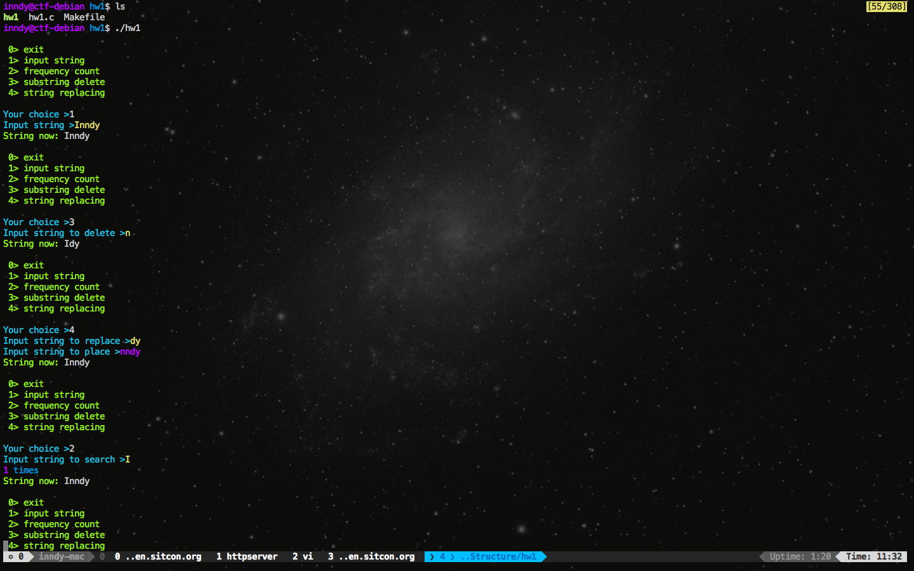

## How to compile

1. Choose an UNIX-compatable OS
2. Install `gcc` and `make`
3. Just `make` and you will get `hw1`
4. Run

### Compile Instruction on Windwos (Maybe)

1. Compile `hw1.c`
2. Run

## Tested Platform

- Debian 8.2 -- Jessie
- Mac OS X 10.11 -- El Capitan

*NOT TESTED ON WINDOWS*, but I think it will work.

## Screen Shot

